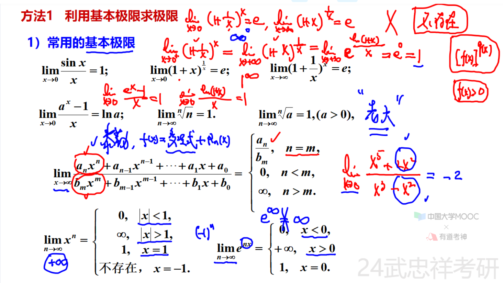
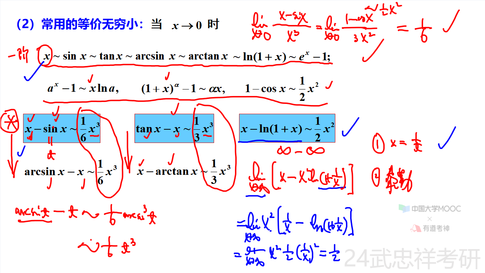
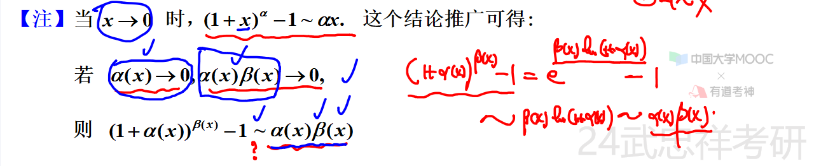
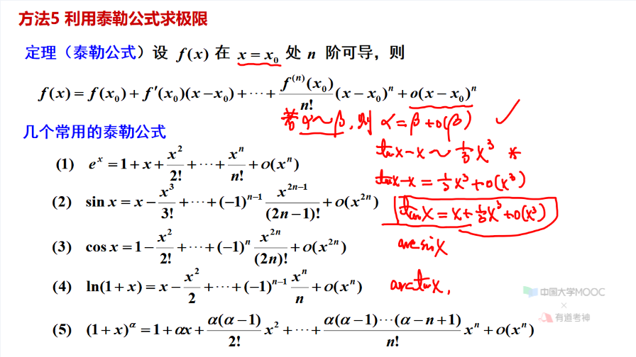
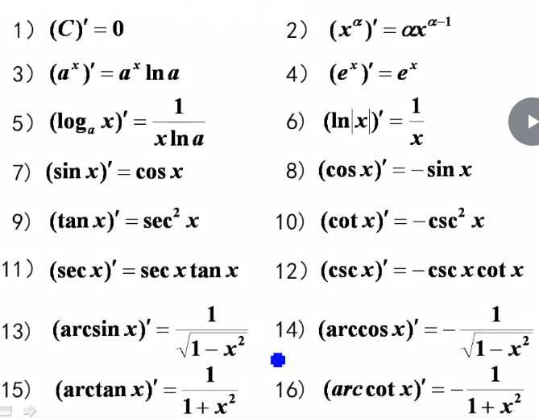
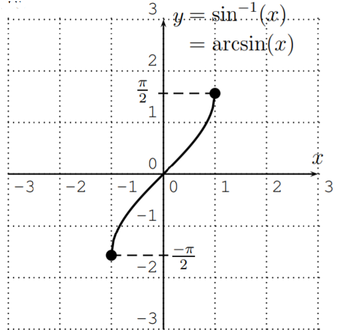
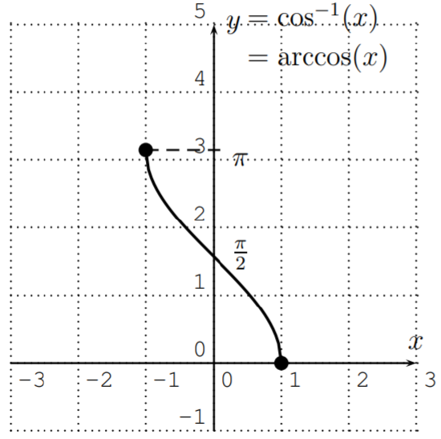
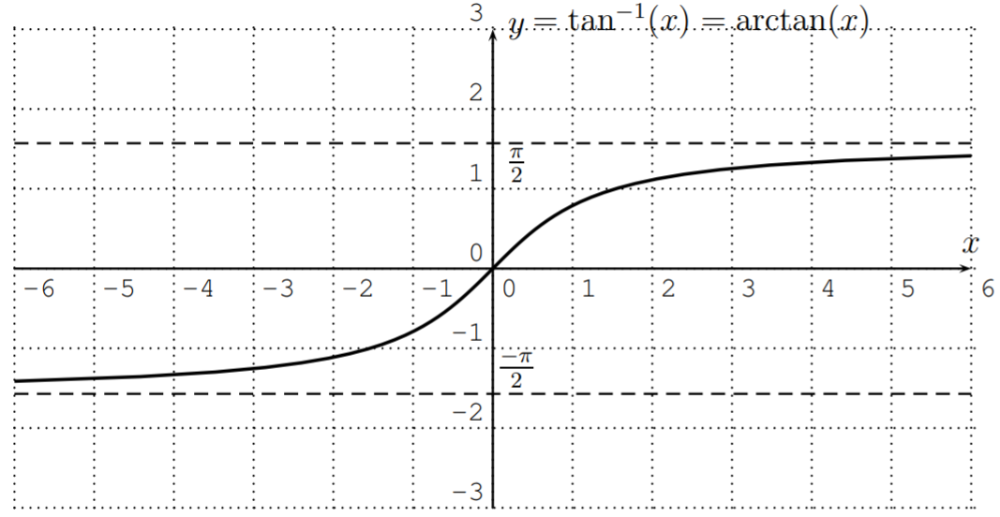

# 目录

- [第一章 函数极限连续](#第一章-函数极限连续)
- [第二章 导数与微分](#第二章-导数与微分)
- [第三章 微分中值定理及其应用](#第三章-微分中值定理及其应用)
- [第四章 不定积分](#第四章-不定积分)
- [第五章 定积分及反常积分](#第五章-定积分及反常积分)
- [第六章 定积分的应用](#第六章-定积分的应用)
- [第七章 微分方程](#第七章-微分方程)
- [第八章 多元微分及其应用](#第八章-多元微分及其应用)
- [第九章 二重积分](#第九章-二重积分)
- [第十章 无穷级数](#第十章-无穷级数)
- [第十一章 空间解析几何及其应用](#第十一章-空间解析几何及其应用)
- [第十二章 三重积分及线面积分](#第十二章-三重积分及线面积分)
- [附录 理论基础](#附录-理论基础)

# 第一章 函数极限连续

## 第一节 函数

### 一、函数概念及常见函数

1. **函数概念**
   - 唯一确定：定义域、对应法则
 **复合函数**
   - 要求：值域含于定义域
3. **反函数**
   - 要求：一一映射
   - 同一函数的反函数有两种写法（x、y对换），在坐标轴中对应两个图形：一个与原函数重合，另一个与原函数关于y=x对称。
4. **初等函数**
   - 基本初等函数：幂函数、指数、对数、三角、反三角

### 二、函数的性质

1. **单调性**
2. **奇偶性**
3. **周期性**
   - 定义域：正无穷到负无穷
4. **有界性**
   - 要求：有下界+有上界

### 题型：

1. 复合函数
2. 函数性态

## 第二节 极限

### 一、极限的概念

1. **数列的极限**
   - 概念：刻画“要多接近有多接近；与前有限项无关
   - 推导：奇数项列极限=偶数项列极限-->原数列有极限
2. **函数的极限**
   1. 自变量趋于无穷大时函数的极限
      - 注意：无穷包括正无穷、负无穷
   2. 自变量趋于有限值时函数的极限
      - 注意：当该值上无定义时，极限为“趋向而不等于”
      - 注意：“趋近于0”包含0+/0-；“趋近于无穷”包含正无穷、副无穷；趋近于某有限值时亦然
      - 推导：左右极限存在且相等<-->极限存在
      - 注意：不可将极限不存在的分式拆开计算

### 二、极限性质

1. **有界性**
   1. 数列：收敛则有界
   2. 函数：在x0处极限存在-->在x0某去心邻域有界?（反之不存在：$\sin\frac{1}{x}$）
2. **保号性**
   1. 数列
   2. 函数
      - 注意：两种表示区分符号
3. **极限值与无穷小之间的关系**

### 三、极限存在准则

1. **夹逼准则**
   - 做法：n项和（n为无穷时不能简单处理）
2. **单调有界准则**
   - 概念：单调有界/单增+上界/单减+下界数列必有极限
   - 做法：由递推关系式求极限（由递推关系得出单调有界，再代入a=f(a)）

### 四、无穷小量

1. 无穷小量的概念：极限为0
2. 无穷小的比较
   - 概念：高阶/低阶/同阶/等价/k阶无穷小（将“无穷小”视为函数）
3. 无穷小的性质：有限/有界don't matter

### 五、无穷大量

1. 无穷大量的概念：绝对值
2. 常用的无穷大量的比较
3. 无穷大量的性质
4. 无穷大量和无界变量的关系：对任意vs存在
5. 无穷大量与无穷小量的关系：分母不为0

### 题型：

1. 极限的概念、性质、存在准则
2. 求极限
   1. 利用基本极限求极限
      1. 常用的基本极限
         - 概念：
         - 注意：幂指函数底数必须为正【基本假设】
         - 推导：善用导数
      2. “1的无穷次方”型常用结论
         - 推导：凑1
         - 做法：写标准形式；求极限；得结果
         - 思想：见到$a^{x}$，想到凑-1【凑无穷小】
   2. 利用等价无穷小代换求极限
      1. 代换原则
         - a)乘除关系可以换
         - b)加减关系在一定条件下可以换：不为0【丢失精度】
      2. 常用的等价无穷小
         - 概念：
         - 推导：多项式之比推得常数/互相推导
         - 思路：提取公因式【无穷减无穷-->0减0】
         - 注意：代换时必须确认为无穷小
         - 思路：置换为e的指数【消除原指数】再用$e^{x}$做等价代换
         - 概念：当指数不足以弥补无穷小时...等价为乘积
         - 推广：
   3. 利用有理运算法则求极限
         - 注意：拆分前先判断极限是否存在
         - 概念：存在+-不存在=不存在；其他情况不一定
   4. 利用洛必达法则求极限
         - 概念：0比0/无穷比无穷；在去心邻域内可导；分母不为0；右端存在/等于无穷-->右端=左端
         - 思路：将式子化为0比0/无穷比无穷
         - 注意：n阶可导在洛贝塔中最多用到n-1阶导函数（下一步多用导数定义）:二阶可导不能保证二阶导函数极限存在（不保证其连续）
   5. 利用泰勒公式求极限
         - 概念：
         - 补充：$\frac{1}{1-x}$=1+x+$x^2$+...
         - 规律：求导sinx-->cosx-->-sinx-->-cosx-->sinx 
   6. 利用夹逼原理求极限
         - 做法：放缩法【将次要项统一】
         - 做法：提取公因式（分式/根号）【本质：无穷比/减无穷-->0比/减0】
   7. 利用单调有界准则求极限  
         - 方法：证存在【单调有界】+代入极限
         - 做法：$2ab \leq a^2 + b^2$、$\sqrt[3]{abc} \leq \frac{1}{3}(a + b + c)$【有界】+作差/商【单调】
   8. 利用定积分定义求极限
         - 思想：因为多项式是有规律的，所以可看作定积分
         - 做法：提取1/n-->找到被积函数、积分区间
3. 无穷小量阶的比较 
    - 思想：仅关注最高阶

## 第三节 函数的连续性

### 一、连续性的概念

1. 概念
    - $\Delta y$=0或$\lim\limits_{x \to x_0} f(x) = f(x_0)$；左连续/右连续

### 二、间断点及其分类

1. 概念
    - 去心邻域；不连续
2. 分类
    - 第一类：左右极限均存在：可去间断点；跳跃间断点
    - 第二类：至少有一个不存在：无穷间断点；振荡间断点【无穷则无极限】

### 三、 连续性的运算和性质

1. 概念
    - 连续函数的和、差、积、商、复合仍为连续函数
    - 基本初等函数在定义域内连续；初等函数在定义区间内连续（范围更小）【$\sqrt{\cos(x) - 1}$】

### 四、闭区间上连续函数的性质

1. 概念
    - 有界性定理：在闭区间上连续-->有界
    - 最值定理：在闭区间上连续-->有最值
    - 介值定理：连续且两端点函数值不等-->$\forall$C$\in$(f(a),f(b)),$\exists$至少一个k，使f(k)=C
        - 注意：端点不能是无穷：存在A...
    - 零点定理：连续且函数积小于0-->中间存在函数值为0

### 题型：

1. 讨论函数的连续性及间断点的类型
    - 规范：由于f(x)是初等函数，则除x=...外处处连续
    - 结论：$\frac{d}{dx} \ln| x | = \frac{1}{x}$
    - 做法：无穷小-->可去间断点；无穷大-->无穷间断点
2. 有关闭区间上连续函数性质的证明
    - 规范：由f(x)在[c,d]上连续，（故）存在最小值m，最大值M【最值定理】...由【介值定理】推论...

## 题型总结：

### 函数
- **题型一**：复合函数
- **题型二**：函数性态

### 极限
- **题型一**：极限的概念、性质及存在准则
- **题型二**：求极限【1】
- **题型三**：无穷小量阶的比较【2】

### 连续
- **题型一**：讨论连续性及间断点类型【3】
- **题型二**：介值定理、最值定理及零点定理的证明题

# 第二章 导数与微分

## 一、导数和微分的概念

1. 导数的概念
    - 概念：刻画变化率
    - 注意：$f'(x_0)$与$f(x_0)$密切相关【与极限不同】
    - 概念：左/右导数【$\Delta x$->$0_{+}$/$0_{-}$】
2. 微分的概念
    - 概念：函数改变量的线性主部
    - 概念：可微<-->可导
    - 结论：导数不为0,微分是delta x同阶无穷小；反之，高阶无穷小；为1,等价无穷小
3. 导数与微分的几何意义
    - 注意：有切线不一定可导【$y = \sqrt[3]{x}$】
    - 概念：导数是切线斜率，微分是切线增量
4. 连续、可导、可微之间的关系
    - 可导比连续更严格：连续不一定可导：|x|
    - 可导"等价于“可微
    - x0的邻域可导推不出导函数在x0极限存在/连续【$x^2 \cdot \sin\frac{1}{x}$且f(0)=0】

## 二、导数公式及求导法则

1. 基本初等函数的导数公式
    - 概念： 
2. 求导法则：
    1. 有理运算法则
    2. 复合函数求导法
    3. 概念：f(x)可导时：f(x)奇则f'(x)偶；f(x)偶则f'(x)奇；f(x)周期则f'(x)周期
    4. 结论：偶函数的泰勒展开式只有偶数次（导）项【奇次项f'(x)=0】；奇函数亦然
3. 隐函数求导法
    - 做法：两边同时求导，y是x函数
4. 反函数的导数
    - 概念：反函数导数=原函数导数的倒数
5. 参数方程求导法
    - 注意：对x求导不等于对t求导
6. 对数求导法

## 三、高阶导数

1. 高阶导数
    - 结论：f(x)在x处n阶可导-->在x某邻域内f(x)必具有一切低于n阶的导数
2. 常用的高阶导数公式
    - sin'x
    - (uv)'
## 题型：

1. 【难点】导数定义 例17 f(0)=0什么意义？
    - 结论：f(x)=g(x)*|x-a|,且g(x)在x=a处连续,则f(x)在x=a处可导充要条件为g(a)=0【防止尖】
2. 复合函数、隐函数和参数方程求导
    - 概念：参数方程：y对x求导-->y'(t)/x'(t)
    - 注意：左边对x求导时右边不能对t求导
3. 【难点】高阶导数
4. 导数应用
    - 导数的几何意义
    - 相关变化率【复合函数求导】

## 题型总结
1. 导数与微分：
    - 利用导数定义求极限
    - 利用导数定义求导数
    - 利用导数定义判断可导性【难】
2. 求导法：
    - 复合函数
    - 隐函数
    - 参数方程 
    - 高阶导数【难】
3. 导数应用：
    - 切线、法线
    - 相关变化率

# 第三章 微分中值定理及其应用

## 一、微分中值定理

1. 概念
    - 费马引理：f(x)在x0可导且取得极值-->f'(x0)=0
    - 罗尔定理：闭区间连续+开区间可导+端点函数值相等-->存在(a,b)中的值使导数为0
    - 拉格朗日中值定理：闭区间连续+开区间可导-->存在(a,b)中的值使导数为斜率
    - 柯西中值定理：闭区间连续+开区间可导-->存在(a,b)中的值使斜率相等【拉+参数方程】【x方程化】
    - 结论：从前往后：推广；从后往前：特例
    - 皮亚诺型余项泰勒公式【局部】
        - 条件：n阶可导；邻近x0
        - 研究范围：极限、极值
    - 拉格朗日型余项泰勒公式【整体】
        - 条件：n+1阶可导；区间(a,b)内
        - 研究范围：最值、不等式

## 二、导数应用

1. 函数的单调性
2. 函数的极值
    - 概念：极值点：f(x)在x0取极大/小值【极值点是x轴上的点】
    - 概念：f(x)在x0可导且取得极值-->f'(x0)=0
    - 概念：驻点：导数为0 
    - 注意：驻点不等于极值点；对可导函数，驻点包含极值点；极值点可能包含驻点+导数不存在点
    - 概念：极值第一充分条件：一阶导前后是否变号
    - 概念：极值第二充分条件：二阶导在x0大于/小于0
3. 函数的最大最小值
    1. 连续函数在[a,b]的最值：驻点+不可导点+端点；极值点唯一-->仅判断此点
    2. 最大最小值的应用题
4. 曲线的凹凸性
    - 概念：对区间上任意x1 x2成立：中点函数值大于/小于端点函数值平均
    - 概念：f''(x)>0
    - 概念：拐点：凹凸性发生变化【拐点是曲线上的点】
    - 判定：拐点：二阶导函数等于0,三阶不等于0
5. 曲线的渐近线
    - 概念：x趋近于无穷时，f(x)极限为A-->y=A水平渐近线【最多两条】
    - 概念：垂直渐近线
    - 概念：斜渐近线：y=ax+b
    - 注意：一个函数有可能同时有斜和水平渐近线【一侧只能有一个水平/斜渐近线】
    - 做法：先判断斜渐近线：能否写成线性函数+无穷小
6. 函数的作图
7. 曲线的弧微分与曲率
    - 曲率：K=|y''|/(1+y'^2)^3/2
    - 曲率半径：R=1/K
8. 导数在经济学的应用（仅数三）
    1. 经济学中常见的函数
    2. 边际函数和边际分析
    3. 弹性函数和弹性分析

  方程的根：存在性：零点定理 罗尔定理 个数：单调性

# 第四章 不定积分

## 一、不定积分的概念和性质

1. 原函数
2. 不定积分
3. 不定积分的几何意义
4. 原函数存在定理
    - 概念：导函数f(x)连续则一定存在原函数
    - 概念：导函数有第一类间断点，则无原函数
    - 概念：导函数有第二类间断点，则有可能有原函数?
5. 不定积分的性质
    - 实质：反向求导

# 第五章 定积分及反常积分
# 第六章 定积分的应用
# 第七章 微分方程
# 第八章 多元微分及其应用
# 第九章 二重积分
# 第十章 无穷级数
# 第十一章 空间解析几何及其应用
# 第十二章 三重积分及线面积分
# 附录 理论基础
## 方法：

- 排除法：找特殊函数/将常数取特殊值如0
- 同乘
- 作差/作商
- 放缩
- 换元-->通分
- 分母复杂时：分子同一个数加减以凑整数/指数取负以颠倒底数
- 遇到抽象函数：凑出条件做给的式子以整体运算
- 分母为x+1凑x^2-1；有指数项化为对数指数
## 定理/结论：

1. 对于所有的实数 $a$ 和 $b$，都有以下的不等式成立：
   $$||a| - |b|| \leq |a - b|$$
2. 取整符号
   $$x-1 < [x] \leq x$$
3. $\frac{d}{dx}\arcsin(x) = \frac{1}{\sqrt{1 - x^2}}$ 
     
   $\frac{d}{dx}\arccos(x) = -\frac{1}{\sqrt{1 - x^2}}$ 
     
   $\frac{d}{dx}\arctan(x) = \frac{1}{1 + x^2}$ 
       
4. 不等式：
   - $2ab \leq a^2 + b^2$
   - $\sqrt[3]{abc} \leq \frac{1}{3}(a + b + c)$
5. $\frac{d}{dx} \ln| x | = \frac{1}{x}$
6. 结论：偶函数的泰勒展开式只有偶数次（导）项【奇次项f'(x)=0】；奇函数亦然
7. 结论：f(x)=g(x)*|x-a|,且g(x)在x=a处连续,则f(x)在x=a处可导充要条件为g(a)=0【防止尖】
