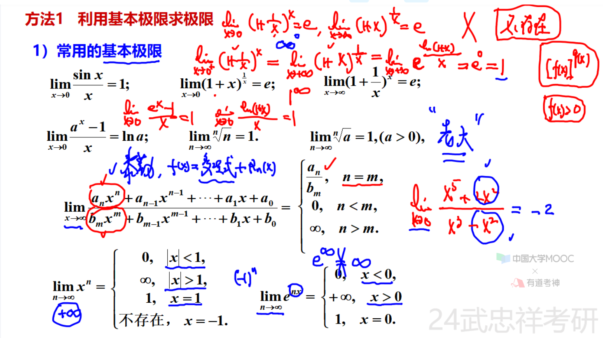
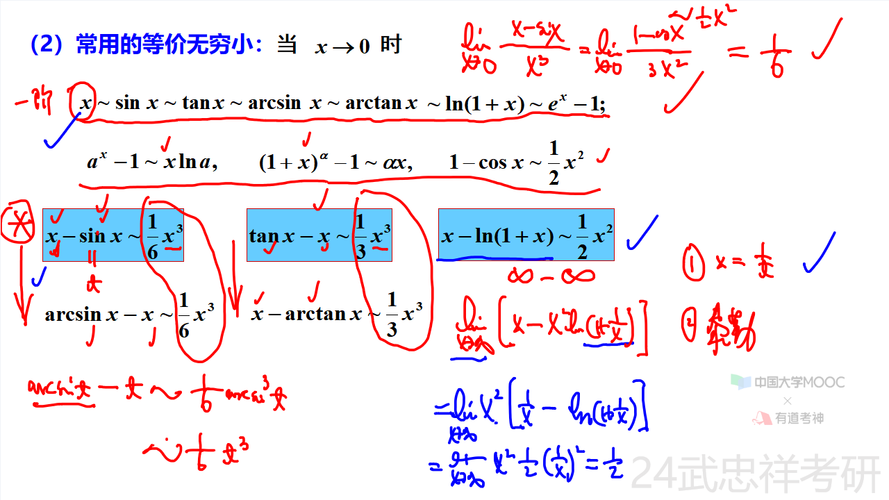
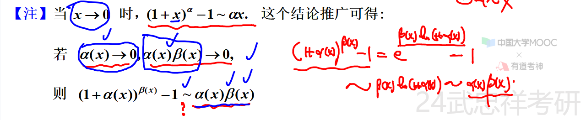
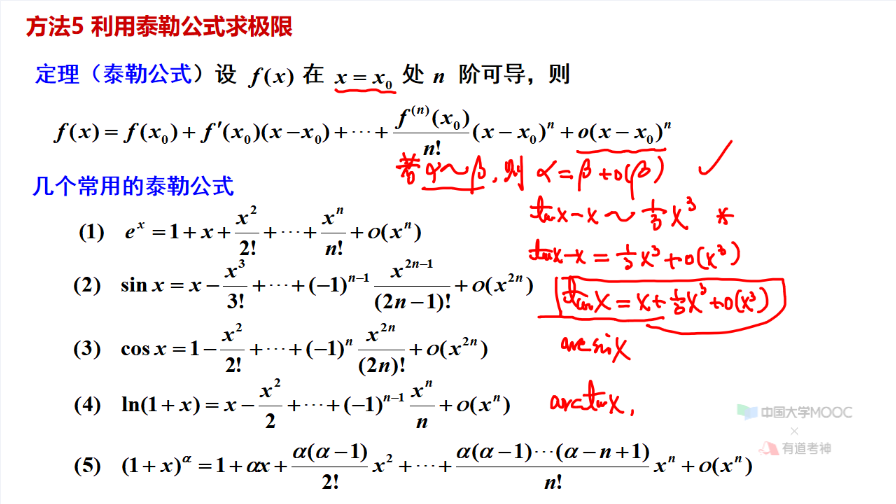
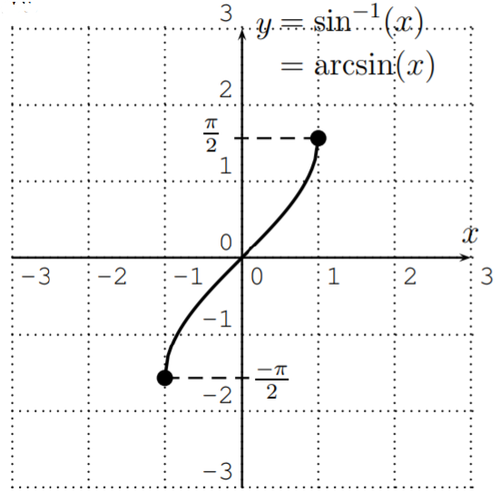
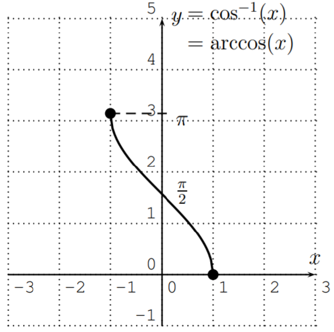
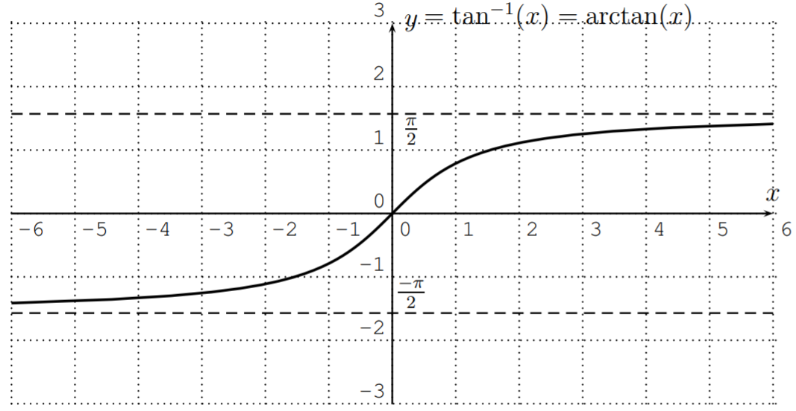

# 目录

- [第一章 函数极限连续](#第一章-函数极限连续)
- [第二章 导数与微分](#第二章-导数与微分)
- [第三章 微分中值定理及其应用](#第三章-微分中值定理及其应用)
- [第四章 不定积分](#第四章-不定积分)
- [第五章 定积分及反常积分](#第五章-定积分及反常积分)
- [第六章 定积分的应用](#第六章-定积分的应用)
- [第七章 微分方程](#第七章-微分方程)
- [第八章 多元微分及其应用](#第八章-多元微分及其应用)
- [第九章 二重积分](#第九章-二重积分)
- [第十章 无穷级数](#第十章-无穷级数)
- [第十一章 空间解析几何及其应用](#第十一章-空间解析几何及其应用)
- [第十二章 三重积分及线面积分](#第十二章-三重积分及线面积分)
- [附录 理论基础](#附录-理论基础)

# 第一章 函数极限连续

## 第一节 函数

### 一、函数概念及常见函数

1. **函数概念**
   - 唯一确定：定义域、对应法则
2. **复合函数**
   - 要求：值域含于定义域
3. **反函数**
   - 要求：一一映射
   - 同一函数的反函数有两种写法（x、y对换），在坐标轴中对应两个图形：一个与原函数重合，另一个与原函数关于y=x对称。
4. **初等函数**
   - 基本初等函数：幂函数、指数、对数、三角、反三角

### 二、函数的性质

1. **单调性**
2. **奇偶性**
3. **周期性**
   - 定义域：正无穷到负无穷
4. **有界性**
   - 要求：有下界+有上界

## 第二节 极限

### 一、极限的概念

1. **数列的极限**
   - 概念：刻画“要多接近有多接近；与前有限项无关
   - 推导：奇数项列极限=偶数项列极限-->原数列有极限
2. **函数的极限**
   1. 自变量趋于无穷大时函数的极限
      - 注意：无穷包括正无穷、负无穷
   2. 自变量趋于有限值时函数的极限
      - 注意：当该值上无定义时，极限为“趋向而不等于”
      - 注意：“趋近于0”包含0+/0-；“趋近于无穷”包含正无穷、副无穷；趋近于某有限值时亦然
      - 推导：左右极限存在且相等<-->极限存在
      - 注意：不可将极限不存在的分式拆开计算

### 二、极限性质

1. **有界性**
   1. 数列：收敛则有界
   2. 函数：在x0处极限存在-->在x0某去心邻域有界?（反之不存在：$\sin\frac{1}{x}$）
2. **保号性**
   1. 数列
   2. 函数
      - 注意：两种表示区分符号
3. **极限值与无穷小之间的关系**

   - 做法：n项和（n为无穷时不能简单处理）
2. **单调有界准则**
   - 概念：单调有界/单增+上界/单减+下界数列必有极限
   - 做法：由递推关系式求极限（由递推关系得出单调有界，再代入a=f(a)）

### 四、无穷小量

1. 无穷小量的概念：极限为0
2. 无穷小的比较
   - 概念：高阶/低阶/同阶/等价/k阶无穷小（将“无穷小”视为函数）
3. 无穷小的性质：有限/有界don't matter

### 五、无穷大量

1. 无穷大量的概念：绝对值
2. 常用的无穷大量的比较
3. 无穷大量的性质
4. 无穷大量和无界变量的关系：对任意vs存在
5. 无穷大量与无穷小量的关系：分母不为0

## 题型：

1. 极限的概念、性质、存在准则
2. 求极限
   1. 利用基本极限求极限
      1. 常用的基本极限
         - 概念：
         - 注意：幂指函数底数必须为正【基本假设】
         - 推导：善用导数
      2. “1的无穷次方”型常用结论
         - 推导：凑1
         - 做法：写标准形式；求极限；得结果
         - 思想：见到$a^{x}$，想到凑-1【凑无穷小】
   2. 利用等价无穷小代换求极限
      1. 代换原则
         - a)乘除关系可以换
         - b)加减关系在一定条件下可以换：不为0【不导致无穷小】
      2. 常用的等价无穷小
         - 概念：
         - 推导：多项式之比推得常数/互相推导
         - 思路：提取公因式【无穷减无穷-->0减0】
         - 注意：代换时必须确认为无穷小
         - 思路：置换为e的指数【消除原指数】再用$e^{x}$做等价代换
         - 概念：当指数不足以弥补无穷小时...等价为乘积
         - 推广：
   3. 利用有理运算法则求极限
         - 注意：拆分前先判断极限是否存在
         - 概念：存在+-不存在=不存在；其他情况不一定
   4. 利用洛必达法则求极限
         - 概念：0比0/无穷比无穷；在去心邻域内可导；分母不为0；右端存在/等于无穷-->右端=左端
         - 思路：将式子化为0比0/无穷比无穷
         - 注意：n阶可导在洛贝塔中最多用到n-1阶导函数（下一步多用导数定义）:二阶可导不能保证二阶导函数极限存在（不保证其连续）
   5. 利用泰勒公式求极限
         - 概念：
         - 
   6. 利用夹逼原理求极限
   7. 利用单调有界准则求极限  
   8. 利用定积分定义求极限

# 第二章 导数与微分
# 第三章 微分中值定理及其应用
# 第四章 不定积分
# 第五章 定积分及反常积分
# 第六章 定积分的应用
# 第七章 微分方程
# 第八章 多元微分及其应用
# 第九章 二重积分
# 第十章 无穷级数
# 第十一章 空间解析几何及其应用
# 第十二章 三重积分及线面积分
# 附录 理论基础

## 方法：

- 排除法：找特殊函数/将常数取特殊值如0
- 同乘
- 作差/作商
- 放缩
- 换元-->通分
- 分母复杂时：分子同一个数加减以凑整数/指数取负以颠倒底数

## 定理/结论：

1. 对于所有的实数 $a$ 和 $b$，都有以下的不等式成立：
   $$||a| - |b|| \leq |a - b|$$
2. 取整符号
   $$x-1 < [x] \leq x$$
3. $\frac{d}{dx}\arcsin(x) = \frac{1}{\sqrt{1 - x^2}}$ 
     
   $\frac{d}{dx}\arccos(x) = -\frac{1}{\sqrt{1 - x^2}}$ 
     
   $\frac{d}{dx}\arctan(x) = \frac{1}{1 + x^2}$ 
       

